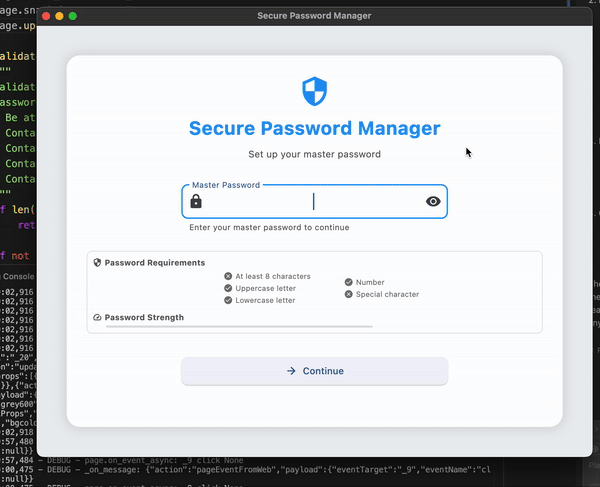

# 🔐 Encrypted Password Manager

A modern, secure password manager built with Python and Flet, designed to keep your credentials safe while providing a beautiful user experience.


## ✨ Features

### 🔒 Security
- **AES-256 Encryption**: Industry-standard encryption for all stored data
- **PBKDF2 Key Derivation**: Secure key generation with 100,000 iterations
- **Master Password Protection**: Single password to access all credentials
- **Secure Storage**: No plaintext passwords stored anywhere
- **Automatic Clipboard Clearing**: Passwords are cleared from clipboard after 30 seconds

### 💻 User Interface
- **Modern Design**: Clean and intuitive interface built with Flet
- **Responsive Layout**: Adapts to different screen sizes
- **Password Visibility Toggle**: Easily verify stored passwords
- **Dark/Light Mode**: Choose your preferred theme
- **User-Friendly Navigation**: Simple and efficient workflow

### 🔄 Password Management
- **Add New Entries**: Store website credentials securely
- **Edit Existing Entries**: Update stored information easily
- **Delete Entries**: Remove unwanted entries
- **Password Generation**: Create strong, random passwords
- **Copy to Clipboard**: One-click password copying

## 🚀 Getting Started

### Prerequisites
- Python 3.8 or higher
- pip (Python package installer)

### Installation

1. Clone the repository:
```bash
git clone https://github.com/yourusername/encrypted-password-manager.git
cd encrypted-password-manager
```

2. Create a virtual environment (recommended):
```bash
python -m venv venv
source venv/bin/activate  # On Windows: venv\Scripts\activate
```

3. Install dependencies:
```bash
pip install -r requirements.txt
```

4. Run the application:
```bash
python app.py
```

## 📝 Usage Guide

### First-Time Setup
1. Launch the application
2. Create a strong master password
3. Start adding your credentials

### Managing Passwords
1. **Adding a New Entry**:
   - Click "Add New Entry" on the dashboard
   - Enter site name, username, and password
   - Use the password generator for strong passwords
   - Click "Save Entry"

2. **Viewing/Editing Entries**:
   - Click "Manage Entries" on the dashboard
   - Select an entry to view details
   - Use the action buttons to show/copy/delete passwords
   - Click "Edit" to modify an entry

3. **Generating Passwords**:
   - Click "Generate Password" on the dashboard
   - Use the generated password or generate a new one
   - Copy to clipboard with one click

### Security Best Practices
- Use a strong, unique master password
- Enable two-factor authentication where possible
- Regularly update your master password
- Keep your master password secure and private
- Don't share your master password with anyone

## 🔧 Technical Details

### Architecture
- **Frontend**: Flet (Python-based UI framework)
- **Backend**: Python
- **Database**: SQLite
- **Encryption**: Cryptography library (AES-256)

### File Structure
```
encrypted-password-manager/
├── app.py              # Main application file
├── encryption_utils.py # Encryption utilities
├── requirements.txt    # Project dependencies
├── vault.db           # Encrypted password database
└── master_pass.json   # Master password hash storage
```

## 🤝 Contributing

Contributions are welcome! Please feel free to submit a Pull Request.

1. Fork the repository
2. Create your feature branch (`git checkout -b feature/AmazingFeature`)
3. Commit your changes (`git commit -m 'Add some AmazingFeature'`)
4. Push to the branch (`git push origin feature/AmazingFeature`)
5. Open a Pull Request

## 📜 License

This project is licensed under the MIT License - see the [LICENSE](LICENSE) file for details.

## ⚠️ Disclaimer

This password manager is provided as-is, without any guarantees. While it implements strong security measures, users are responsible for their own security practices and the security of their stored credentials.

## 🙏 Acknowledgments

- [Flet](https://flet.dev/) for the amazing UI framework
- [Cryptography](https://cryptography.io/) for the encryption utilities
- All contributors and users of this project


